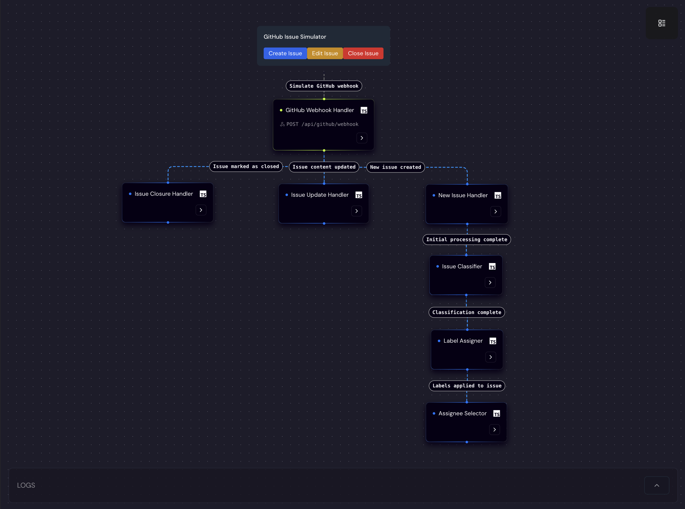
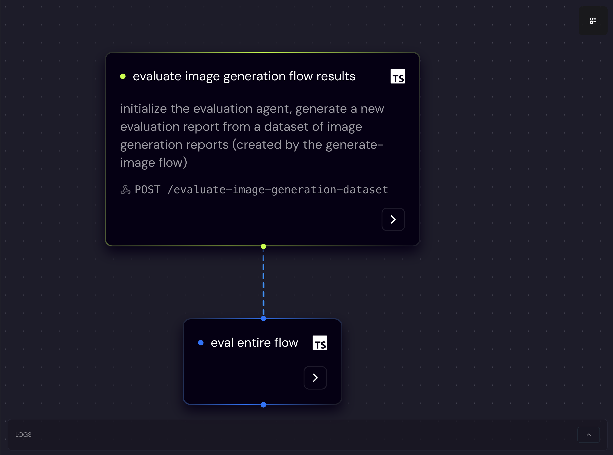

<a name="readme-top"></a>

<div align="center">
  
  <h1 align="center"> AI Agent Framework Built for Software Engineers </h1>
</div>

<div align="center">
  <a href="https://motia.dev"></a>
  <a href="https://discord.gg/nJFfsH5d6v"></a>
  <a href="https://motia.dev/docs"></a>
  <a href="https://www.npmjs.com/package/motia"></a>
  <a href="https://www.npmjs.com/package/motia"></a>
  <hr>
</div>

Motia lets developers create, test, and deploy production-ready AI agents in minutes, in a framework that will feel familar to software engineering teams. Write your agent logic in the languages and package you know and love. Visualize execution in real-time, and deploy without DevOps headaches.

*Motia is currently in Beta. This means we're actively developing, iterating quickly, and looking for feedback from early adopters like you!*

## Start Building Now
```bash
npx motia@latest create -n new-project
cd new-project && npm run dev
```

## The Problem Motia Solves

Building production-grade AI agents is tough. You're usually forced to choose:

- No-code/Low-code tools: Quick to start, but can't handle real-world complexity at scale.
- Fully-agentic Frameworks: Great for creative tasks but difficult to manage and control consistent outputs
- ML-focused Frameworks: Designed for model training and optimization, not for orchestrating complex business workflows.
- Custom code: Quickly becomes unmanageable as agents grow in complexity and span across teams.

Motia gives you full, code-first control of your agents and automations with the simplicity of a visual interface, letting you focus on what truly matters: your business logic, not your infrastructure.


## Why Choose Motia?

Motia is built for developers who want to build agentic and intelligent, event-driven systems rapidly and reliably. Here's what makes Motia the ideal choice:

- **🚀 Zero Infrastructure Headaches** - No Kubernetes expertise required. Deploy agents with a single command.
- **💻 True Code-First Development** - Write agent logic in familiar languages, not proprietary DSLs.
- **🔀 Unique Multi-Language Support** - Mix Python for ML, TypeScript for type safety, and Ruby for APIs in the same agent.
- **🧩 Composable Steps with Runtime Validation** - Build agents from modular, reusable components with automatic input/output validation.
- **📊 Built-in Observability** - Debug agent behavior with visual execution graphs and real-time logging.
- **⚡️ Instant APIs & Webhooks** - Expose agent functionality via HTTP endpoints without extra code.
- **🧠 Full Control Over AI Logic** - Use any LLM, vector store, or reasoning pattern without restrictions.
- **🤸‍♀️ Flexible Control** - Easilty switch between agentic and deterministic control within the same flow.

## Ideal for Agents & Intelligent Automations

Motia's event-driven architecture and modular steps are perfectly suited for building sophisticated agents and intelligent automations. Whether you're creating GenAI-powered workflows, complex decision-making systems, or data processing pipelines, Motia provides the ideal foundation.

- **Create Agent Components as Steps:** Encapsulate agent logic, tool integrations, and decision-making processes within individual steps, leveraging the rich ecosystems of JavaScript, Python, and Ruby.
- **Orchestrate Agent Interactions with Flows:** Design complex agentic workflows by connecting steps to create sophisticated sequences of actions and reactions, easily integrating steps written in different languages.
- **Test and Evaluate Agent Behavior Visually:** The Motia Workbench provides real-time visualization and testing tools to observe and refine your agents' behavior and ensure they perform as expected, regardless of the underlying step language.
- **Iterate and Evolve Agents Rapidly:** Motia's modularity and observability make it easy to iterate on agent logic, experiment with different approaches, and continuously improve your intelligent systems, taking advantage of the strengths of each supported language.

## Motia Workbench: Your Visual Control Center

The Motia Workbench is your browser-based development environment.


- **Interactive Flow Visualization:** See your steps connected in a dynamic, visual graph. Understand event flow and step interactions at a glance.
- **Real-time Testing:** Trigger API endpoints and emit events directly from the UI to test your flows and agents in real-time.
- **Live Log Streaming:** Monitor logs in real-time within the Workbench, making debugging and observing execution a breeze.
- **Step Customization:** Create custom UI components for your steps to enhance visualization and tailor the Workbench to your workflows.

## 🗂 Examples

### Finance Agent

A powerful event-driven financial analysis workflow built with Motia that combines web search, financial data, and AI analysis to provide comprehensive investment insights.


**Key Features:**

- Real-time Financial Analysis: Combines multiple data sources for comprehensive insights
- AI-Powered Insights: Leverages OpenAI GPT-4 for intelligent market analysis
- Web Search Integration: Aggregates latest market news and analysis
- Financial Data Integration: Real-time stock and company information

**Technologies:** TypeScript, Alpha Vantage API, SerperDev, OpenAI

[View Example →](https://github.com/MotiaDev/motia-examples/tree/main/examples/finance-agent)

<hr/>

### GitHub Integration Agent

A comprehensive agent for automating GitHub issue and pull request management using AI-powered classification and routing.

<div style="display: flex; gap: 10px;">
  
  
</div>

**Key Features:**

- AI-powered issue and PR classification
- Automatic label assignment based on content
- Smart reviewer suggestions based on expertise
- Automatic movement between stages in the development lifecycle

**Technologies:** TypeScript, OpenAI, GitHub API

[View Example →](https://github.com/MotiaDev/motia-examples/tree/main/examples/github-integration-workflow)

<hr/>

### Gmail Account Manager

An intelligent Gmail agent that monitors, analyzes, and automatically responds to incoming emails.


**Key Features:**

- Email classification and urgency detection
- Automated responses based on content analysis
- Smart email organization
- Daily summaries via Discord

**Technologies:** TypeScript, Python, Google APIs, Discord, Hugging Face

[View Example →](https://github.com/MotiaDev/motia-examples/tree/main/examples/gmail-workflow)

<hr/>

### Trello Task Automation

Streamline development processes with an intelligent task progression agent for Trello boards.


**Key Features:**

- Automated card movement between lists
- Task validation and requirement checking
- AI-generated task summaries
- Slack integration for notifications

**Technologies:** TypeScript, Trello API, OpenAI, Slack

[View Example →](https://github.com/MotiaDev/motia-examples/tree/main/examples/trello-flow)

<hr/>

### Retrieval-Augmented Generation (RAG)

A complete RAG agent implementation for building knowledge-based AI applications.


**Key Features:**

- Web page content extraction and parsing
- Text chunking and embedding
- Vector database integration
- AI-powered question answering

**Technologies:** Python, TypeScript, FAISS, Google's Generative AI

[View Example →](https://github.com/MotiaDev/motia-examples/tree/main/examples/rag_example)

<hr/>

### AI Image Generation and Evaluation

An agent that generates and evaluates AI images with feedback loops and quality metrics.

<div style="display: flex; gap: 10px;">
  
  
</div>

**Key Features:**

- Prompt enhancement with AI
- Image generation with Flux
- Evaluation of generated images
- Dataset reports with quality metrics

**Technologies:** TypeScript, Python, Claude, Flux, OpenAI

[View Example →](https://github.com/MotiaDev/motia-examples/tree/main/examples/vision-example)

## 🚀 Getting Started

Each example includes its own README with detailed setup instructions. Generally, you'll need:

1. Clone this repository
2. Navigate to the example directory
3. Install dependencies
4. Configure environment variables
5. Run the agent with Motia

## Quick Start

Ready to get started in minutes? Follow these simple steps using **pnpm** and the automated project creation:

1.  **Create a new project using the Motia CLI:**

    ```bash
    npx motia create -n my-first-agent
    ```

    _(Replace `my-first-agent` with your desired project name)_

    This command will:

    - Create a new folder `my-first-agent`
    - Set up a basic Motia project with example steps
    - Install dependencies using pnpm

2.  **Navigate into your new project directory:**

    ```bash
    cd my-first-agent
    ```

3.  **Start the Motia development server:**

    ```bash
    pnpm run dev
    ```

4.  **Open the Motia Workbench in your browser (usually `http://localhost:3000`)**. You should see a pre-built flow named "default" with example steps visualized.

5.  **Test an example API Step:** In your terminal, use `curl` to trigger the example API endpoint (often `/default` in the default template):

    ```bash
    curl -X POST http://localhost:3000/default \
    -H "Content-Type: application/json" \
    -d '{}'
    ```

    Alternatively, use the Motia CLI to emit an event (for event-based steps in the template):

    ```bash
    npx motia emit --topic test-state --message '{}'
    ```

    Check the Workbench logs – you should see logs indicating the step execution and event flow!

**Congratulations! You've just created and run your first Motia workflow using the automated project setup.**

## Start building your AI powered agents with simple steps

- Configure a simple to emit/subscribe, assign to a flow and inculde runtime validation
- Define a function to handle when the step is triggered
- Import any package

```TypeScript
import { OpenAI } from 'openai';
import { z } from 'zod';
import type { EventConfig, StepHandler } from 'motia';

const openai = new OpenAI({
    apiKey: process.env.OPENAI_API_KEY,
});

export const config: EventConfig = {
  type: 'event',
  name: 'Auto-Reply to Support Emails',
  subscribes: ['email.received'],
  emits: ['email.send'],
  flows: ['email-support'],
  input: z.object({ subject: z.string(), body: z.string(), from: z.string() }),
};

export const handler: StepHandler<typeof config> = async (inputData, context) => {
  const { subject, body, from } = inputData;
  const { emit, logger } = context;

  const sentimentResponse = await openai.chat.completions.create({
    model: "gpt-4o",
    messages: [{ role: "user", content: `Analyze the sentiment of the following text: ${body}` }],
  });

  const sentiment = sentimentResponse.choices[0].message.content;

  logger.info('[EmailAutoReply] Sentiment analysis', { sentiment });

  emit({
    type: 'email.send',
    data: { from, subject, body, sentiment },
  });
};
```

## Next Steps

- **Dive into the Documentation:** Explore the [full Motia documentation](https://motia.dev/docs) to understand core concepts, step types, state management, and more.
- **Explore Examples:** Check out practical [examples](https://motia.dev/docs/real-world-use-cases) to see Motia in action and get inspiration for your own workflows and agents.
- **Join the Community:** Connect with other Motia users and the development team on our [Discord server](https://discord.gg/nJFfsH5d6v) and contribute to the project on [GitHub](https://github.com/MotiaDev/motia).

**License:** [MIT](LICENSE)
