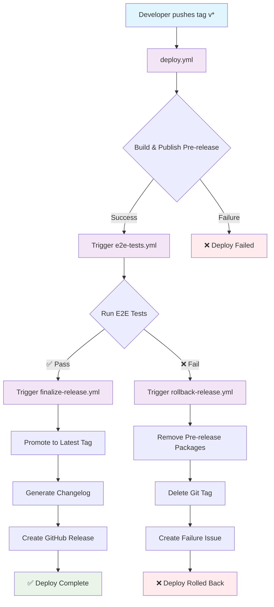
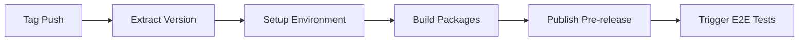
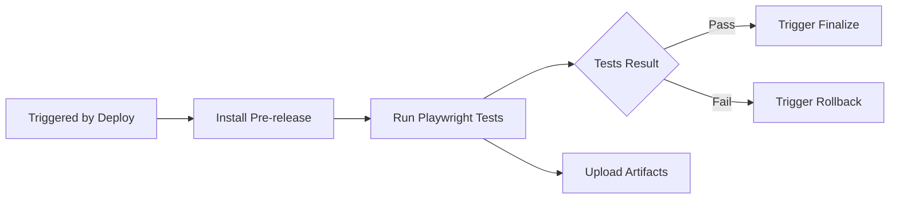
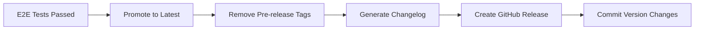
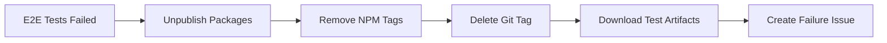
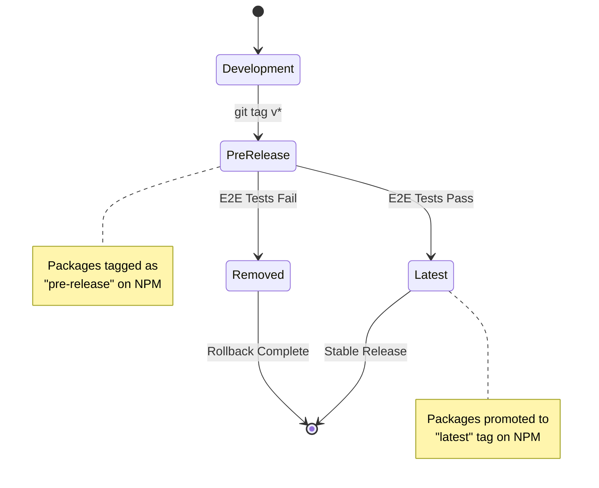
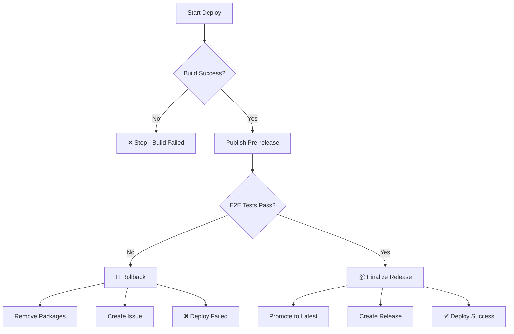

# Deploy Flow Diagram - Motia Framework

## Detailed Flow by Workflow

### 1. Deploy Release (deploy.yml)

### 2. E2E Tests (e2e-tests.yml)

### 3A. Finalize Release (finalize-release.yml)

### 3B. Rollback Release (rollback-release.yml)

## NPM Package States

## Typical Timeline

```mermaid
gantt
    title Deploy Timeline
    dateFormat X
    axisFormat %M:%S
    
    section Deploy
    Build & Publish Pre-release    :deploy, 0, 3
    
    section Testing
    E2E Tests Execution           :test, after deploy, 15
    
    section Success Path
    Promote to Latest             :promote, after test, 2
    Generate Changelog            :changelog, after promote, 1
    Create GitHub Release         :release, after changelog, 1
    
    section Failure Path
    Rollback Process              :crit, rollback, after test, 3
```

## Decision Points

## Legend

- 🟢 **Success**: Process completed successfully
- 🔴 **Failure**: Process failed, rollback required  
- 🟡 **In Progress**: Process executing
- 🔄 **Rollback**: Reverting changes
- 📦 **NPM**: Package operations
- 🏷️ **Git**: Tag/release operations
- 🧪 **Test**: Test execution 