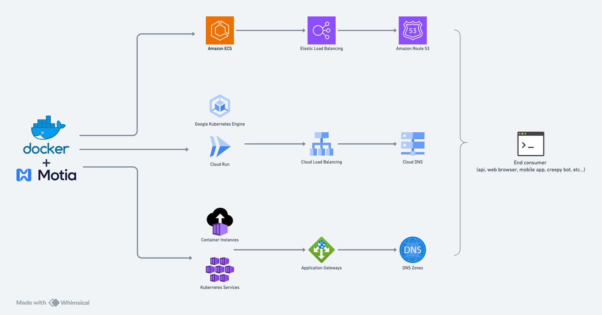

# RFC: Motia Docker (Self Host)

## Status

- **RFC Date**: 2025-07-14
- **Status**: Draft <!-- One of: Draft, Final Comment Period, Accepted, Rejected, Implemented -->
- **Authors**: Rodrigo
- **Reviewers**: Sergio, Ytallo, Filipe, Mike

## Summary

<!--
Write a clear, concise summary (2-3 sentences) of what you're proposing.
This should be understandable by someone who isn't familiar with the technical details.

Example: "This RFC proposes implementing an observability system for Motia that provides
comprehensive tracing and real-time monitoring through an intuitive horizontal timeline interface."
-->

This RFC proposes a solution to enable users to self-host Motia through docker.

## Background

<!--
Explain the current state and why this change is needed.
Include:
- What currently exists (if anything)
- What problems users are experiencing
- Why existing solutions are insufficient
- What pain points this addresses

Be specific with examples where possible.
-->

Currently Motia is only available to be deployed to the Motia Cloud. This is great but some users have been reaching out asking for self-hosting options. Some users have been using docker to run Motia's cli `dev` command. This is a quick viable solution, and we can improve it by providing a `start` command that can simplify the tasks executed to run Motia (hot reloading, type generation, etc...) and eventually focus on performance over time (improved runtime using Go, less memory usage, middleware to configure event queue and storage, etc).

The main challenges are around self-hosting limitations:

- Missing a Motia provided self hosting solution
- Missing documentation for self-hosting options
- Missing a self-hosting example
- Lack of self-hosting options creates a barrier for first entry users to try Motia in a production environment

## Goals

### Primary Goals

<!--
List the main objectives this RFC aims to achieve.
Be specific and measurable where possible.
Use action verbs and focus on user/developer benefits.
-->

1. Motia provided self-hosting solution using docker and a new `start` command from the CLI focused on removing unnecessary features from the `dev` command (hot reloading, type generation, mermaid, workbench, etc...)
2. Documentation for self-hosting option
3. Provide a self-hosting example through a video tutorial, this example will demonstrate how to deploy Motia to a cloud provider (AWS, GCP, Azure, etc...)

### Secondary Goals

<!--
Optional: List nice-to-have objectives that aren't critical for the first implementation.
These might be addressed in future iterations.
-->

1. Configurable event queue and storage system
2. Improved runtime using Go

### Non-Goals

<!--
Explicitly state what this RFC is NOT trying to solve.
This prevents scope creep and sets clear boundaries.
-->

- Bring your own infrastructure (BYOI) solution, folks will need to figure out how to deploy the containerized Motia application into their own infrastructure and apply the necessary protections (api gateway, load balancer, etc...)

## Architecture Overview

### High-Level System Architecture

 

> ⚠️ _The references to cloud providers are just examples, we won't be providing any deployment solutions for self-hosting Motia in any of the cloud providers. As part of the validation of this RFC we will be providing a video tutorial on how to deploy Motia in a cloud provider, but **each user will be responsible for deploying Motia to their own infrastructure**._

## Technical Considerations

For this RFC there are no technical considerations regarding the deployment to an infrastructure provider, since we won't be providing a BYOI solution. Users will have to figure out on their own how to host the containerized Motia application into their own infrastructure and apply the necessary protections (api gateway, load balancer, etc...)

Some technical considerations using docker are:

- Provide a docker image for the Motia application, this can help us control maintainability and support for the environment where the Motia application runs. It can also help us narrow edge cases in which folks use deprecated or legacy images.
- We need to be clear about the limitations of running Motia in a docker container through the express server (which is what is used to run Motia in the `dev` command).
- We need to provide users a solution to lock the express server, i.e.: authenticated access

## Success Metrics

- Enforce an analytics metric through an env variable, injected as part of the docker image used to containerize motia. This will allow us to track the number of users using self-hosting motia.
- This project will live in its own repository, we can also track the number of stars and forks on the repo.

## Future Considerations

- Add support for configurable event queue and storage system, i.e.: setup RabbitMQ and Redis or MongoDB for event queue and storage
- Improve the runtime, explore using Go to improve performance
- Expose a health check for the Motia application, i.e.: checks for event queue, storage, server, etc...

## Questions and Considerations

<!--
Optional: List open questions or areas where you'd like specific feedback.
This helps guide the review process.
-->

- Should we provide a motia-docker image to containerize motia?
- Are these the only features that need to be disabled for the `start` command?
  - Hot reloading
  - Type generation
  - Mermaid generator
  - Workbench, we might want to give users the option to conditionally disable Workbench

## Conclusion

Providing a self-hosting option for Motia will allow users to evaluate a Motia application in a "production" like environment.
