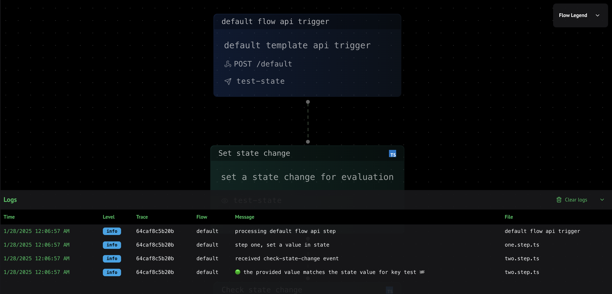

If you setup your Motia project with the **default** template, you will see the following **steps** in your project:

<Tabs items={['api.step.ts', 'one.step.ts', 'two.step.ts']}>
  <Tab value='api.step.ts'>
  ```typescript
  // api.step.ts
  import { ApiRouteConfig, StepHandler } from '@motiadev/core'
  import { z } from 'zod'

  const inputSchema = z.object({})

  export const config: ApiRouteConfig = {
    type: 'api',
    name: 'default flow api trigger',
    description: 'default template api trigger',
    path: '/default',
    method: 'POST',
    emits: ['test-state'],
    bodySchema: inputSchema,
    flows: ['default'],
  }

  export const handler: StepHandler<typeof config> = async (req, { logger, emit }) => {
    logger.info('processing default flow api step', req)

    await emit({
      type: 'test-state',
      data: {},
    })

    return {
      status: 200,
      body: { message: 'test-state topic emitted' },
    }
  }
  ```
  </Tab>
  <Tab value='one.step.ts'>
  ```typescript
  // one.step.ts
  import { EventConfig, StepHandler } from '@motiadev/core'
  import { z } from 'zod'
  import equal from 'deep-equal'

  type Input = typeof inputSchema

  const inputSchema = z.object({})

  export const config: EventConfig<Input> = {
    type: 'event',
    name: 'Set state change',
    description: 'set a state change for evaluation',
    subscribes: ['test-state'],
    emits: ['check-state-change'],
    input: inputSchema,
    flows: ['default'],
  }

  export const handler: StepHandler<typeof config> = async (input, { traceId, logger, state, emit }) => {
    logger.info('step one, set a value in state')

    const message = 'welcome to motia!';
    await state.set<any>(traceId, 'test', message)

    await emit({
      type: 'check-state-change',
      data: {key: 'test', expected: message}
    })
  }
  ```
  </Tab>
  <Tab value='two.step.ts'>
  ```typescript
  // two.step.ts
  import { EventConfig, StepHandler } from '@motiadev/core'
  import { z } from 'zod'
  import equal from 'deep-equal'

  type Input = typeof inputSchema

  const inputSchema = z.object({
    key: z.string(),
    expected: z.optional(z.unknown()),
  })

  export const config: EventConfig<Input> = {
    type: 'event',
    name: 'Check state change',
    description: 'check state change',
    subscribes: ['check-state-change'],
    emits: [],
    input: inputSchema,
    flows: ['default'],
  }

  export const handler: StepHandler<typeof config> = async (input, { traceId, logger, state }) => {
    logger.info('received check-state-change event', input)

    const value = await state.get<any>(traceId, input.key)

    if (value !== input.expected) {
      logger.error(`🔴 the provided  value for the state key ${input.key} does not match`, { value, expected: input.expected })
    } else {
      logger.info(`🟢 the provided value matches the state value for key ${input.key} 🏁`)
    }
  }
  ```
  </Tab>
</Tabs>

Here’s how to **run** and **debug** these Steps locally:

<Steps>
  <Step>
  ### 1. Start the Dev Server

  1. Open a terminal and navigate to your **Motia** project root folder
  2. Run the following command to initialize the Motia development server:

  <Tabs items={['pnpm', 'yarn', 'npm', 'bun']}>
    <Tab value='pnpm'>
    ```bash
    pnpm run dev
    ```
    </Tab>
    <Tab value='yarn'>
    ```bash
    yarn run dev
    ```
    </Tab>
    <Tab value='npm'>
    ```bash
    npm run dev
    ```
    </Tab>
    <Tab value='bun'>
    ```bash
    bun run dev
    ```
    </Tab>
  </Tabs>
  3. You can [open](http://localhost:3000) Motia Workbench, select the **default** flow from the left side bar
  4. Expand the logs container

  
  </Step>
  <Step>
  ### Trigger the API Step

  Run the following command to emit an event to the **default** flow:

  <Tabs items={['cli', 'curl']}>
    <Tab value='cli'>
    ```bash
    npx motia emit --topic test-state --message '{}'
    ```
    </Tab>
    <Tab value='curl'>
    ```bash
    curl -X POST http://localhost:3001/default \
     -H "Content-Type: application/json" \
     -d '{}'
    ```
    </Tab>
  </Tabs>
  </Step>
  <Step>
  ### Checking Logs

  After emitting the event, you should see the logs in the logs container

  

  <Callout>If something fails, watch for error logs or stack traces. You can add `logger.info()`, `logger.error()`, etc., in your handlers for more detail.</Callout>
  </Step>
  <Step>
  ### Stopping the development server

  Press **Ctrl + C** (or **Cmd + C** on macOS) in your terminal. That’s it!
  </Step>
</Steps>
