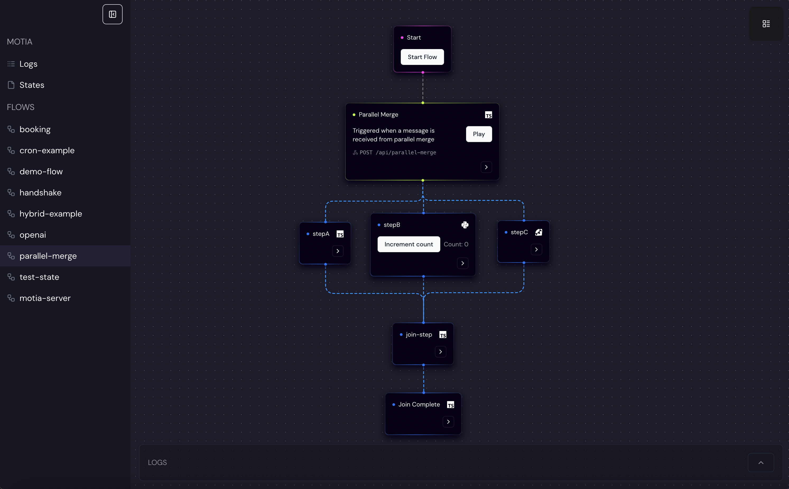

This guide will walk you through everything you need to define a minimal **step**, set up your Motia project, and run the **Motia** dev server – all in one go, using **pnpm** for package management.

<Steps>
  <Step>
  ### Setup your project: Create a New Project Folder

Let's create a new Motia project in a dedicated folder. This is the recommended approach for keeping your projects organized.

  <Tabs items={['Automated', 'Manual']}>
<Tab value="Automated">
  <Tabs items={['npx', 'motia Global CLI']}>
    <Tab value="npx">
      Use `npx` to run the project creation command directly:

      <Tabs items={['npx']}>
        <Tab value="npx">
          ```bash
          npx motia@latest create -n <your-project-name>
          ```
        </Tab>
      </Tabs>
    </Tab>

    <Tab value="motia Global CLI">
      **First, install the Motia CLI globally:**

      <Tabs items={['pnpm (Global)', 'npm (Global)', 'yarn (Global)', 'bun (Global)']}>
        <Tab value="pnpm (Global)">
          ```bash
          npm install -g motia
          ```
        </Tab>
        <Tab value="npm (Global)">
          ```bash
          npm install -g motia
          ```
        </Tab>
        <Tab value="yarn (Global)">
          ```bash
          yarn global add motia
          ```
        </Tab>
        <Tab value="bun (Global)">
          ```bash
          bun add -g motia
          ```
        </Tab>
      </Tabs>

      **Then, create your project using the globally installed `motia` command:**

      ```bash
      motia create -n <your-project-name>
      ```
    </Tab>

  </Tabs>

    *   **This will**:
        *   Download and run the Motia CLI project creation tool
        *   Create a new project directory named `<your-project-name>`.
        *   Set up a basic Motia project structure inside the new folder.
        *   Install necessary dependencies using pnpm within the project folder.
        *   Add a `dev` script to your `package.json`.
        *   Include example steps to get you started.

  <Callout type="info">
    **Choosing a Project Name:** Replace `<your-project-name>` with your desired project folder name.

    **Alternative Templates:** To see other templates, run: `npx motia templates` (or `motia templates` if you installed globally).

  </Callout>

You should see a new folder created with the following files inside:

  <Files>
    <Folder name="steps" defaultOpen>
      <File name="one.step.ts" />
      <File name="two.step.ts" />
      <File name="api.step.ts" />
    </Folder>
    <File name="package.json" />
  </Files>
</Tab>
    <Tab value="Manual">
      <Callout>For these instructions we recommend using `pnpm`. For detailed installation instructions and package manager options, please refer to the [Installation Guide](/docs/getting-started/installation) (Note: In this Quick Start, automated project creation is highly recommended).</Callout>

      **Quick Setup Summary (Manual - Advanced Users):**

      1.  **Create a project directory:**
          ```bash
          mkdir <your-project-name> && cd <your-project-name>
          ```

      2.  **Initialize `package.json`:**
          ```bash
          npm init -y
          ```

      3.  **Install Core Packages:**
          ```package-install
            motia zod
          ```

      4.  **Add `dev` Script to `package.json`:**
          ```json
          {
            "scripts": {
              "dev": "motia dev"
            }
          }
          ```

      5.  **Optional TypeScript Setup:**
          ```package-install
          ts-node typescript -D
          ```

      6.  **Create `steps` Folder:**
          ```bash
          mkdir steps
          ```
    </Tab>

  </Tabs>

  </Step>
  <Step>
  ### Minimal Step Example (Already Included!)

✨ **Good News!** If you used the automated project setup with the `default` template (as recommended above), you can **skip this step!**

The `default` template already includes example steps in the `steps` folder, including `addNumbers.step.js` (or similar, depending on the template). These pre-built steps are ready for you to explore and run.

---

**If you chose not to use the template or want to create a step from scratch manually,** follow these steps:

1.  **Create a `steps` folder** in your project's root directory (if you haven't already).

2.  **Create a new file** named `addNumbers.step.js` (or `addNumbers.step.ts` for TypeScript) inside the `steps` folder.

    <Files>
      <Folder name="steps" defaultOpen>
        <File name="addNumbers.step.js" />
      </Folder>
    </Files>

3.  **Paste the following code** into your `addNumbers.step.js` file:

    ```javascript
    exports.config = {
      type: 'event', // "event", "api", or "cron"
      name: 'AddNumbers',
      subscribes: ['add-numbers'],
      emits: ['numbers-added'],
      flows: ['numbers'],
    }

    exports.handler = async (input, { emit }) => {
      const sum = (input.a || 0) + (input.b || 0)
      await emit({
        topic: 'numbers-added',
        data: { result: sum },
      })
    }
    ```

    This minimal step **listens** for the event `"add-numbers"` and **emits** `"numbers-added"`. It's a basic example to get you started.

  </Step>
  <Step>
  ### Start Motia Development Server & Workbench

Now, let's start Motia and see your workflow in action!

1.  **Open your terminal** in your Motia project's root directory (where your `package.json` file is located).

2.  **Run the development server command:** Use the `dev` script that was set up in your `package.json`:

    <Tabs items={['pnpm', 'yarn', 'npm', 'bun']}>
      <Tab value="pnpm">```bash pnpm run dev ```</Tab>
      <Tab value="yarn">```bash yarn run dev ```</Tab>
      <Tab value="npm">```bash npm run dev ```</Tab>
      <Tab value="bun">```bash bun run dev ```</Tab>
    </Tabs>

    Motia will:

    - **Scan** your `steps` folder for step definition files (`.step.ts`, `.step.js`, `.step.py`, `.step.rb`).
    - **Register** your Steps with the Motia runtime.
    - **Launch** a development server and the Motia Workbench UI (typically at [`http://localhost:3000`](http://localhost:3000)).

    <Callout type="info">
      **Changing the Port:** To run the Workbench on a different port, use the `--port` option: `pnpm run dev --port
      3001`
    </Callout>

  </Step>
  <Step>
    ### View your Flow in the Workbench

    1.  **Open your browser** and navigate to the Motia Workbench.  By default, it's running at:  [`http://localhost:3000`](http://localhost:3000) or [`http://127.0.0.1:3000`](http://127.0.0.1:3000).

    2.  **Locate your Flow in the Sidebar:** On the left sidebar of the Workbench UI, you should see a list of Flows.

        *   **For the default template:**  You'll find a flow named "**default**".
        *   **For the `addNumbers.step.js` example:** You'll find a flow named "**numbers**".

    3.  **Select your Flow:** Click on the flow name in the sidebar.

    4.  **Observe the Visual Flow:** You should now see a visual representation of your flow in the main panel. This is the Motia Workbench visualizing the steps and event flow within your application!

        

        <Callout type="info">
            You can click and drag the nodes in the visual editor to rearrange them for better clarity. Explore the UI to familiarize yourself with the Workbench!
        </Callout>

    </Step>
    <Step>
    ### Test your step

    You can test your step using the **Motia** CLI:

    <Tabs items={['cli', 'curl']}>
      <Tab value='cli'>
      If you used the automated project setup with the default template, you can test your step by emitting the following event:
      ```bash
      npx motia emit --topic test-state --message '{}'
      ```

      If you used the add number example, you can test your step by emitting the following event:

      ```bash
      npx motia emit --topic add-numbers --message '{"a": 5, "b": 3}'
      ```

      </Tab>
      <Tab value='curl'>
        If you used the automated project setup with the default template, you can test your step by emitting the following event:
        ```bash
        curl -X POST http://localhost:3000/default \
        -H "Content-Type: application/json" \
        -d '{}'
        ```
        <Callout type="warn">You can't test the add number example using curl, you will need to use the CLI, using an api endpoint requires an api step.</Callout>
      </Tab>
    </Tabs>

    Motia will:

    Emit a new event with the provided topic and message

    The event manager will detect the new event and match it against your registered step

    Execute your step with the provided input

    Log the journey of the event, including the emitted numbers-added event

    </Step>

</Steps>
