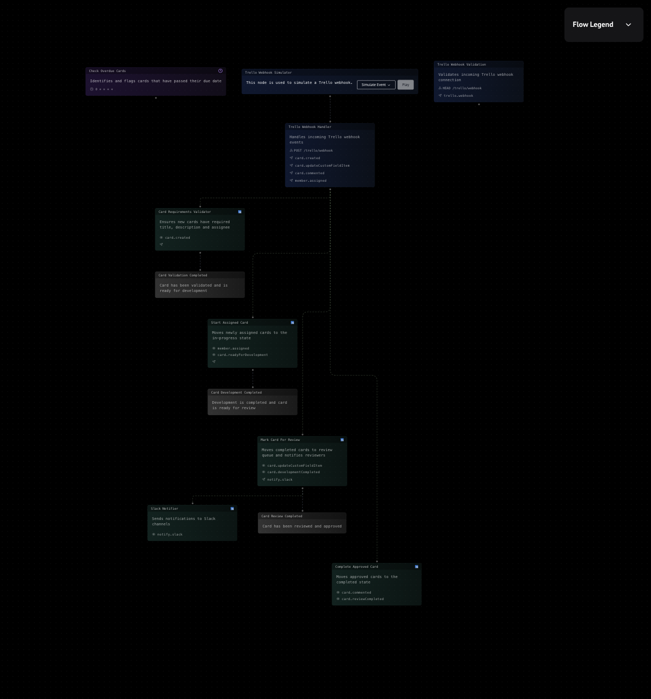

## Live Example

Try out the code directly in your browser:

<CodeSandbox repo="MotiaDev/motia-examples/tree/main/examples/trello-flow" path="/steps" />

## Let's build a Trello automation system that:

1. Automatically progresses cards across board lists
2. Validates card completeness
3. Generates AI-powered summaries for code review
4. Integrates with Slack for notifications
5. Monitors due dates and sends overdue alerts

## Board Structure

The Trello board is organized into four main lists:

- **New Cards**: Entry point for all new cards
- **In Progress**: Active development stage
- **Needs Review**: Code review stage with AI summaries
- **Completed**: Successfully reviewed and approved cards

## The Steps

<Folder name="steps" defaultOpen>
  <File name="trello-webhook.step.ts" />
  <File name="trello-webhook-validation.step.ts" />
  <File name="validate-card-requirements.step.ts" />
  <File name="start-assigned-card.step.ts" />
  <File name="mark-card-for-review.step.ts" />
  <File name="complete-approved-card.step.ts" />
  <File name="check-overdue-cards.step.ts" />
  <File name="slack-notifier.step.ts" />
</Folder>

<Tabs items={['webhook', 'validation', 'requirements', 'assigned', 'review', 'completion', 'overdue', 'slack']}>
  <Tab value="webhook">
    ```ts
    // Receives Trello webhook events
    import { ApiRouteConfig, StepHandler } from 'motia'
    import { z } from 'zod'

    export const config: ApiRouteConfig = {
      type: 'api',
      name: 'Trello Webhook',
      path: '/api/trello-webhook',
      method: 'POST',
      emits: ['trello.webhook'],
      bodySchema: z.object({
        action: z.object({
          type: z.string(),
          data: z.object({}).passthrough(),
        }),
      }),
      flows: ['trello-automation'],
    }

    export const handler: StepHandler<typeof config> = async (req, { emit, logger }) => {
      const { action } = req.body

      logger.info('[TrelloWebhook] Received webhook', {
        type: action.type,
        data: action.data
      })

      await emit({
        topic: 'trello.webhook',
        data: action,
      })

      return {
        status: 200,
        body: { status: 'Accepted' },
      }
    }
    ```

  </Tab>
  <Tab value="validation">
    ```ts
    // Validates webhook events and routes them
    import { EventConfig, StepHandler } from 'motia'
    import { z } from 'zod'

    const webhookSchema = z.object({
      type: z.string(),
      data: z.object({}).passthrough(),
    })

    export const config: EventConfig<typeof webhookSchema> = {
      type: 'event',
      name: 'Webhook Validator',
      subscribes: ['trello.webhook'],
      emits: [
        'trello.cardCreated',
        'trello.cardMoved',
        'trello.commentAdded',
        'trello.memberAdded'
      ],
      input: webhookSchema,
      flows: ['trello-automation'],
    }

    export const handler: StepHandler<typeof config> = async (action, { emit, logger }) => {
      switch (action.type) {
        case 'createCard':
          await emit({
            topic: 'trello.cardCreated',
            data: action.data.card
          })
          break
        case 'updateCard':
          if (action.data.listAfter) {
            await emit({
              topic: 'trello.cardMoved',
              data: {
                card: action.data.card,
                listBefore: action.data.listBefore,
                listAfter: action.data.listAfter
              }
            })
          }
          break
        // ... other cases
      }
    }
    ```

  </Tab>
  <Tab value="requirements">
    ```ts
    // Validates new card requirements
    import { EventConfig, StepHandler } from 'motia'
    import { z } from 'zod'
    import { TrelloClient } from '@/services/trello'

    const cardSchema = z.object({
      id: z.string(),
      name: z.string(),
      desc: z.string(),
      idMembers: z.array(z.string()),
    })

    export const config: EventConfig<typeof cardSchema> = {
      type: 'event',
      name: 'Card Requirements Validator',
      subscribes: ['trello.cardCreated'],
      emits: ['trello.cardValidated'],
      input: cardSchema,
      flows: ['trello-automation'],
    }

    export const handler: StepHandler<typeof config> = async (card, { emit, logger }) => {
      const trello = new TrelloClient()

      const requirements = [
        { check: card.name.length > 0, message: 'Title is required' },
        { check: card.desc.length > 0, message: 'Description is required' },
        { check: card.idMembers.length > 0, message: 'Assignee is required' }
      ]

      const failures = requirements
        .filter(req => !req.check)
        .map(req => req.message)

      if (failures.length > 0) {
        await trello.addComment(card.id,
          `⚠️ Card requirements not met:\n${failures.join('\n')}`)
        return
      }

      await emit({
        topic: 'trello.cardValidated',
        data: { cardId: card.id }
      })
    }
    ```

  </Tab>
  <Tab value="assigned">
    ```ts
    // Handles card assignment
    import { EventConfig, StepHandler } from 'motia'
    import { z } from 'zod'
    import { TrelloClient } from '@/services/trello'

    const assignmentSchema = z.object({
      cardId: z.string(),
      memberId: z.string(),
    })

    export const config: EventConfig<typeof assignmentSchema> = {
      type: 'event',
      name: 'Card Assignment Handler',
      subscribes: ['trello.memberAdded'],
      emits: ['trello.cardStarted'],
      input: assignmentSchema,
      flows: ['trello-automation'],
    }

    export const handler: StepHandler<typeof config> = async (input, { emit, logger }) => {
      const trello = new TrelloClient()

      // Move to In Progress list
      await trello.moveCard(
        input.cardId,
        process.env.TRELLO_IN_PROGRESS_LIST_ID!
      )

      await emit({
        topic: 'trello.cardStarted',
        data: { cardId: input.cardId }
      })
    }
    ```

  </Tab>
  <Tab value="review">
    ```ts
    // Handles review process
    import { EventConfig, StepHandler } from 'motia'
    import { z } from 'zod'
    import { TrelloClient } from '@/services/trello'

    const reviewSchema = z.object({
      card: z.object({
        id: z.string(),
        name: z.string(),
      }),
      listBefore: z.object({ id: z.string() }),
      listAfter: z.object({ id: z.string() }),
    })

    export const config: EventConfig<typeof reviewSchema> = {
      type: 'event',
      name: 'Review Process Handler',
      subscribes: ['trello.cardMoved'],
      emits: ['trello.readyForReview'],
      input: reviewSchema,
      flows: ['trello-automation'],
    }

    export const handler: StepHandler<typeof config> = async (input, { emit, logger }) => {
      // Only handle moves to review list
      if (input.listAfter.id !== process.env.TRELLO_NEEDS_REVIEW_LIST_ID) {
        return
      }

      await emit({
        topic: 'trello.readyForReview',
        data: {
          cardId: input.card.id,
          cardName: input.card.name
        }
      })
    }
    ```

  </Tab>
  <Tab value="completion">
    ```ts
    // Handles card completion
    import { EventConfig, StepHandler } from 'motia'
    import { z } from 'zod'
    import { TrelloClient } from '@/services/trello'

    const commentSchema = z.object({
      text: z.string(),
      card: z.object({
        id: z.string(),
      }),
    })

    export const config: EventConfig<typeof commentSchema> = {
      type: 'event',
      name: 'Card Completion Handler',
      subscribes: ['trello.commentAdded'],
      emits: ['trello.cardCompleted'],
      input: commentSchema,
      flows: ['trello-automation'],
    }

    export const handler: StepHandler<typeof config> = async (input, { emit, logger }) => {
      if (!input.text.toLowerCase().includes('approved')) {
        return
      }

      const trello = new TrelloClient()

      await trello.moveCard(
        input.card.id,
        process.env.TRELLO_COMPLETED_LIST_ID!
      )

      await emit({
        topic: 'trello.cardCompleted',
        data: { cardId: input.card.id }
      })
    }
    ```

  </Tab>
  <Tab value="overdue">
    ```ts
    // Checks for overdue cards
    import { CronConfig, StepHandler } from 'motia'
    import { TrelloClient } from '@/services/trello'

    export const config: CronConfig = {
      type: 'cron',
      name: 'Overdue Cards Checker',
      cron: '0 9 * * 1-5', // 9 AM on weekdays
      emits: ['trello.cardOverdue'],
      flows: ['trello-automation'],
    }

    export const handler: StepHandler<typeof config> = async (_, { emit, logger }) => {
      const trello = new TrelloClient()

      const cards = await trello.getOverdueCards()

      for (const card of cards) {
        await emit({
          topic: 'trello.cardOverdue',
          data: {
            cardId: card.id,
            cardName: card.name,
            dueDate: card.due
          }
        })
      }
    }
    ```

  </Tab>
  <Tab value="slack">
    ```ts
    // Sends Slack notifications
    import { EventConfig, StepHandler } from 'motia'
    import { z } from 'zod'
    import { WebClient } from '@slack/web-api'

    const slack = new WebClient(process.env.SLACK_TOKEN)

    export const config: EventConfig = {
      type: 'event',
      name: 'Slack Notifier',
      subscribes: [
        'trello.readyForReview',
        'trello.cardCompleted',
        'trello.cardOverdue'
      ],
      emits: [],
      flows: ['trello-automation'],
    }

    export const handler: StepHandler<typeof config> = async (event, { logger }) => {
      switch (event.type) {
        case 'trello.readyForReview':
          await slack.chat.postMessage({
            channel: '#code-review',
            text: `🔍 New review needed: ${event.data.cardName}`,
            blocks: [
              {
                type: 'section',
                text: {
                  type: 'mrkdwn',
                  text: `🔍 *New review needed*\n${event.data.cardName}`
                }
              }
            ]
          })
          break
        // ... handle other events
      }
    }
    ```

  </Tab>
</Tabs>

## Visual Overview

Here's how the automation flow works:

<div className="my-8"></div>

1. **Card Validation** → Checks for required information
2. **Progress Tracking** → Moves cards between lists
3. **Review Process** → Generates AI summaries and notifies reviewers
4. **Completion Handling** → Processes approved cards

## Try It Out

<Steps>

### Prerequisites

Make sure you have:

- Trello account with API access
- Node.js installed
- Slack workspace (for notifications)
- OpenAI API key (for AI summaries)

### Clone the Repository

```bash
git clone git@github.com:MotiaDev/motia-examples.git
cd examples/trello-flow
```

### Install Dependencies

```bash
pnpm install
```

### Configure Environment Variables

Create a `.env` file by copying the example:

```bash
cp .env.example .env
```

Update your `.env` with the following credentials:

```env
TRELLO_API_KEY=your_trello_api_key
TRELLO_TOKEN=your_trello_token

OPENAI_API_KEY=your_openai_api_key
OPENAI_MODEL=your_openai_model

SLACK_WEBHOOK_URL=your_slack_webhook_url

TRELLO_NEW_TASKS_LIST_ID=your_new_tasks_list_id
TRELLO_IN_PROGRESS_LIST_ID=your_in_progress_list_id
TRELLO_NEEDS_REVIEW_LIST_ID=your_needs_review_list_id
TRELLO_COMPLETED_LIST_ID=your_completed_list_id
```

### Set Up Trello Board

1. Create a new Trello board with these lists:

   - New Tasks
   - In Progress
   - Needs Review
   - Completed

2. Add a custom field:
   - Status (dropdown: Todo, In Progress, Done)

### Run the Application

```bash
pnpm dev
```

### Test the Flow

1. Create a new card in the "New Tasks" list
2. Assign a member to see it move to "In Progress"
3. Add an "approved" comment to see it move to "Completed"
4. Check Slack for notifications

</Steps>

<Callout type="info">
  For more detailed setup instructions and configuration options, check out the [full
  documentation](https://github.com/MotiaDev/motia-examples/tree/main/examples/trello-flow).
</Callout>{' '}
