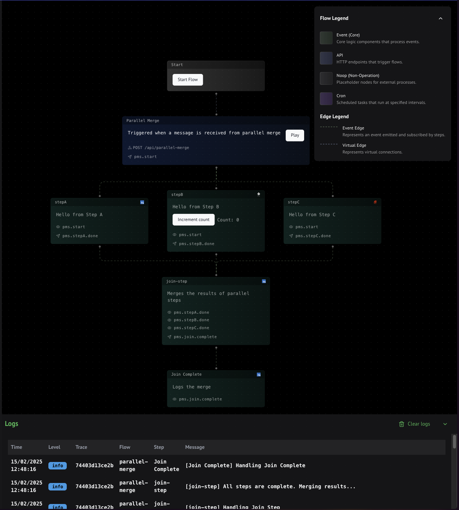

# Code-First Framework for Intelligent Workflows

Motia is a **code-first framework** designed to empower developers to build robust, scalable, and observable event-driven workflows with unparalleled ease. We handle the infrastructure complexities, so you can focus on your business logic.

## Why Choose Motia?

Motia is built with the developer in mind, offering a unique blend of simplicity and power. Here's why Motia stands out:

- 🚀 **Zero Infrastructure Setup:** Say goodbye to the complexities of message queues and event brokers! Motia handles the underlying infrastructure, allowing you to focus solely on building your workflows.

- 🔌 **Plug-and-Play Steps in Your Language:**  Develop your workflow logic using the languages you love: JavaScript, TypeScript, Python, and Ruby. Mix and match languages within the same flow for ultimate flexibility.

- 📊 **Built-in Observability:** Gain deep insights into your workflows with real-time logs, traces, and interactive flow visualizations right in the Motia Workbench. Debugging and monitoring have never been easier.

- ⚡ **Out-of-the-Box API & Scheduling:**  Instantly expose your workflows as HTTP endpoints and schedule tasks with cron expressions – no extra configuration needed.

- ✨ **Flexible and Extensible Architecture:**  Motia is designed to be easily extended and customized. Create custom steps, UI components, and adapt the framework to your specific needs.

- 🧑‍💻 **Developer-First Experience:**  From intuitive APIs and a powerful CLI to comprehensive documentation and a visual workbench, Motia prioritizes developer productivity and a smooth, enjoyable development experience.

## Motia Workbench: Your Development Control Center

Motia Workbench is a built-in, browser-based development platform that acts as your central hub for building, testing, and debugging Motia flows. Key features include:

- **Interactive Flow Visualization:**  See your workflows come to life as dynamic diagrams, making it easy to understand complex event flows and step interactions.

- **Real-time Flow Testing:**  Trigger API endpoints and monitor event propagation through your steps, all within the Workbench UI. Inspect data at each stage to ensure your flows are behaving as expected.

- **Live Log Streaming:**  Access detailed, real-time logs directly in the Workbench. Filter and search logs to quickly pinpoint issues and monitor workflow execution.

- **Step-Level Customization:**  Create custom UI components for your steps to enhance visualization and provide context-specific information directly within the flow diagram.

  

## Core Concepts: Building Blocks of Motia

Motia workflows are built using a few core concepts that work together harmoniously:

| Concept    | Description                                                                                                |
| ---------- | ---------------------------------------------------------------------------------------------------------- |
| **Steps**  | Self-contained, reusable units of business logic. Steps subscribe to events, process data, and emit events. |
| **Flows**  | Logical groupings of related steps that together accomplish a specific task or process.                     |
| **Events** | Messages that are emitted by steps and trigger other steps that subscribe to them.                          |
| **Topics** | Named channels or categories for events, enabling event routing and decoupling between steps.              |

## Unlock Powerful Use Cases

Motia empowers you to build a wide range of sophisticated applications, including:

- 🌐 **API Integrations & Microservices:**  Effortlessly connect disparate systems, create event-driven microservices, and build real-time API-powered applications.

- 🤖 **Intelligent & Agentic Workflows:**  Design complex, AI-driven workflows, orchestrate intricate business processes, and build advanced data pipelines.

- 📊 **Data Transformation & Processing:**  Build scalable ETL/ELT pipelines, implement real-time data streaming, and transform data with ease.

- 🚀 **Rapid Prototyping & Iteration:**  Quickly bring your ideas to life, test new workflows, and iterate rapidly with Motia's visual design and development tools.

### Real-World Industry Applications

Motia is versatile and can be applied across various industries and use cases, such as:

- **E-commerce:** Order processing, inventory synchronization, fraud detection, customer communication automation.
- **Finance:** Trade settlement, risk analysis, compliance monitoring, automated reporting.
- **Healthcare:** Clinical trial management, claims processing, patient monitoring, appointment scheduling.
- **Marketing:** Lead scoring, personalized campaign orchestration, sentiment analysis, social media automation.
- **And much more!**

## Ready to Get Started?

Embark on your Motia journey and start building powerful workflows today:

1.  **Quick Start Guide:** Follow our [Quick Start](/docs/getting-started/quick-start) to set up your first Motia project and create a minimal workflow.
2.  **Explore Examples:** Dive into practical [Examples](/docs/examples) to understand common patterns and real-world use cases.
3.  **Dive into Concepts:**  Delve deeper into Motia's [Core Concepts](/docs/concepts) to gain a solid understanding of the framework's architecture and principles.

## Join the Motia Community

Become part of a growing community of developers and automation enthusiasts!

- 💬 **Join our Discord:**  Connect with the Motia team and fellow developers, ask questions, share ideas, and get real-time help: [Discord Community](https://discord.gg/nJFfsH5d6v)
- 🐙 **Star us on GitHub:** Show your support, contribute to the project, and report issues on our [GitHub Repository](https://github.com/motiadev/motia).
- 🐦 **Follow us on Twitter:** Stay up-to-date with the latest news, announcements, and community updates: [Twitter (@motiadev)](https://twitter.com/motiadev)

We're excited to see what you'll build with Motia!