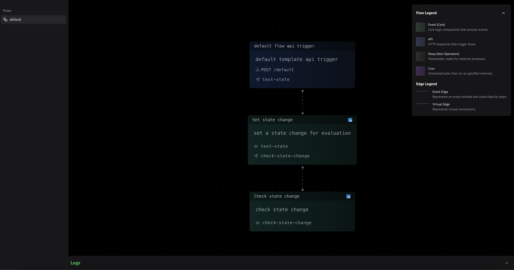

Motia Workbench is a development platform that helps you build and debug your Motia flows. It serves as your control center where you can:

- Visualize flows as interactive diagrams
- Test steps directly in the UI
- Monitor real-time logs
- Debug issues



## Getting Started

Start workbench by running:

<Tabs items={['pnpm', 'yarn', 'npm', 'bun']}>
   <Tab value='pnpm'>
   ```bash
   pnpm run dev
   ```
   </Tab>
   <Tab value='yarn'>
   ```bash
   yarn run dev
   ```
   </Tab>
   <Tab value='npm'>
   ```bash
   npm run dev
   ```
   </Tab>
   <Tab value='bun'>
   ```bash
   bun run dev
   ```
   </Tab>
</Tabs>

<Callout>
Running the dev command starts:
- **Motia Server**: Backend services and API endpoints
- **Motia Workbench**: Web interface at http://localhost:3000
- **Development Mode**: Auto-reloads when changes are made
</Callout>

## Key Features

<Steps>
  <Step>
  ### Flow Visualization
  See your entire flow as an interactive diagram:
  - Steps appear as connected nodes
  - API endpoints are highlighted as entry points
  - Event connections show data flow
  - Click any step to see its details
  </Step>

  <Step>
  ### Real-time Testing
  Test your flows directly in the interface:
  - Send test requests to API endpoints
  - Monitor how events flow through steps
  - Visualize step sequence execution
  - Inspect data at each stage
  </Step>

  <Step>
  ### Live Logs
  Monitor your flow execution:
  ```
  [INFO] [payment-flow] Payment received: $50.00
  [DEBUG] [payment-flow] Processing payment...
  ```
  </Step>

  <Step>
   ### Development Tools
  - **Hot Reload**: Changes reflect immediately in the UI
  - **Error Handling**: Detailed error messages with contextual debugging information
  - **State Inspector**: Real-time monitoring of state management
  </Step>
</Steps>

## Customization

Motia Workbench allows you to customize how your steps appear in the Workbench flow visualization tool.

### NOOP Steps

NOOP (No Operation) steps represent virtual points in your flow where external actions occur:
- Human approvals or reviews
- Webhook callbacks
- External system integrations
- Manual interventions

These steps help visualize important external touchpoints without implementing actual logic.

### UI Steps

UI steps allow you to customize how your steps appear in the Workbench visualization:
- Override the default layout of Event steps
- Customize API endpoint representations
- Modify how Cron jobs are displayed
- Add custom icons and styling

<Breadcrumb items={[{
  name: 'UI Steps',
  url: '/docs/workbench/ui-steps'
},{
  name: 'NOOP Steps',
  url: '/docs/workbench/noop-steps'
}]} />

<Callout>
New to Motia? Follow the **[quick start](/docs/getting-started/quick-start)** guide to get set up.
</Callout>

